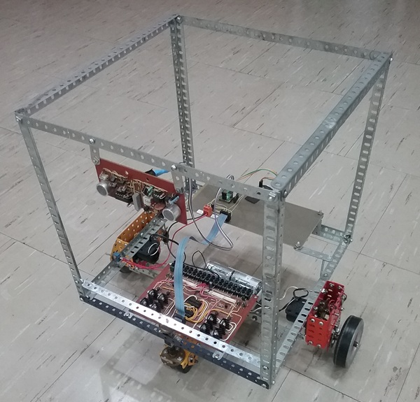
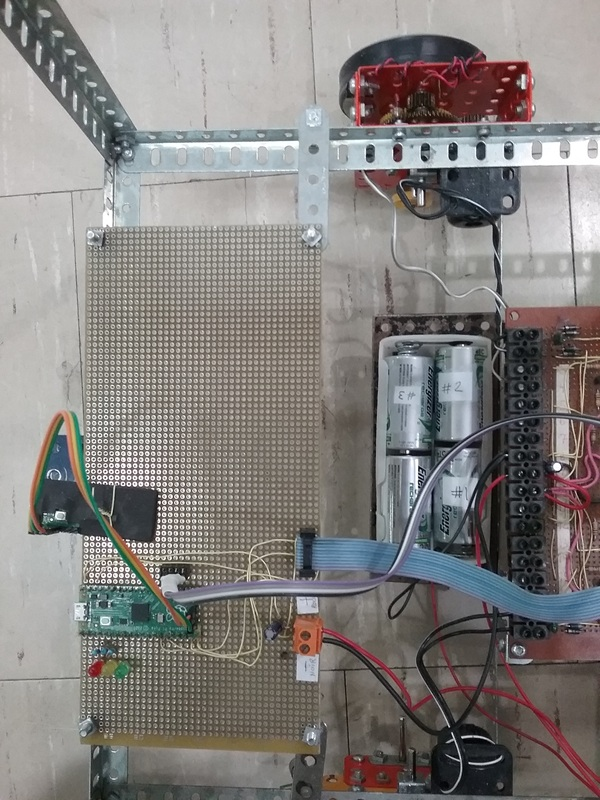
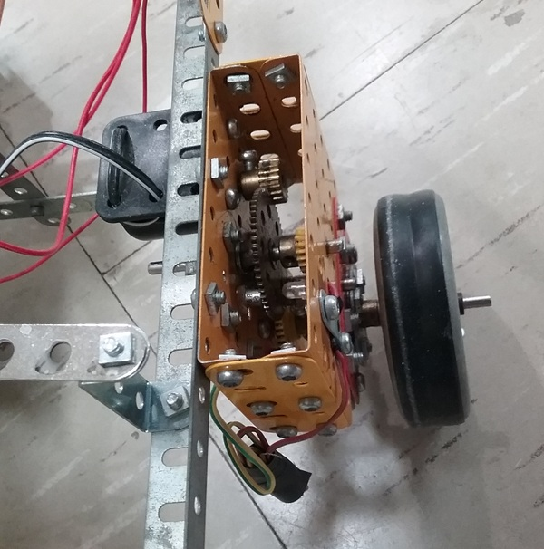
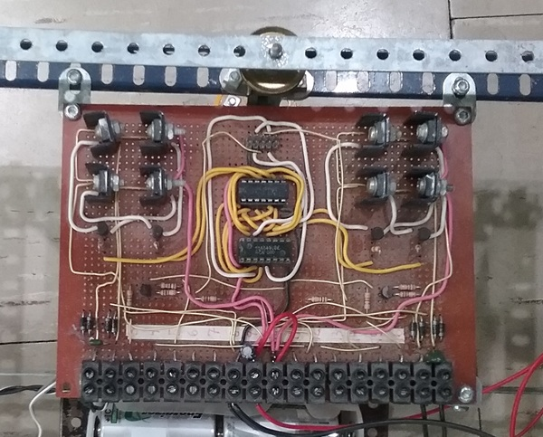
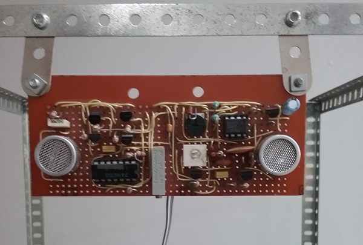

# 🤖 Robot

## ⚙️ Mechanical construction
The robot's frame is built using Meccano parts, featuring two motorized gearboxes for movement. A third free-moving wheel allows smooth direction changes.

## 🔌 Main controller
The **Raspberry Pi Pico** serves as the main processor, handling motor control and sensor inputs.

## 🔌 Motor and gear
Two electric motor are coupled to Meccano gear for speed reduction

## 🛠️ Motor control
**Pulse Width Modulation (PWM)** is used to regulate motor power, enabling precise speed and direction control. An H bridge control the motor.

## 📡 Sonar
An **ultrasonic sensor** detects obstacles and determines their distance, helping the robot navigate its environment.

## 🧭 Navigation
The robot moves randomly without a predetermined path, making decisions based on sensor inputs.

## 💡 Potential improvement
- **Sound Generation:** Adding sound effects to make the robot more engaging and interactive.
- **Radio Frequency Control:** Implementing a wireless transmitter to allow manual control of the robot's movements.

## 💻 Firmware
The firmware is written in **C++** for efficient control and real-time processing.

